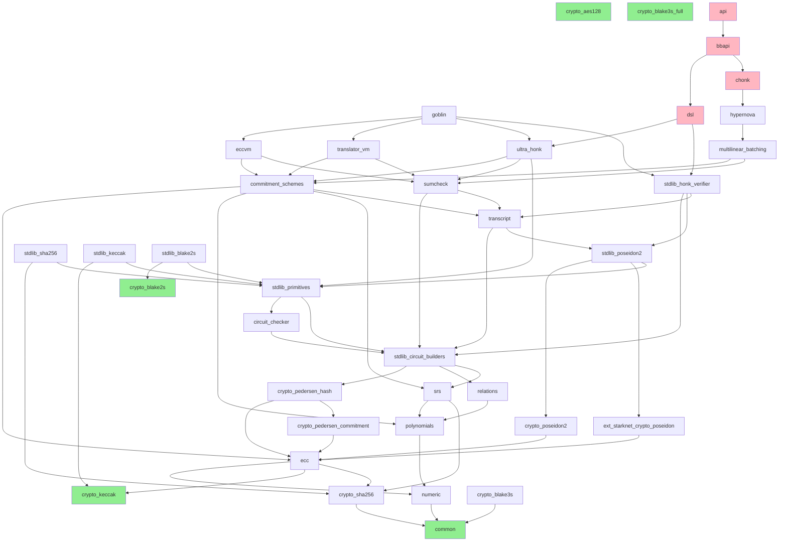

# Barretenberg Module Dependency Graph

## How to Read This

Each module is registered via `barretenberg_module(name dep1 dep2 ...)` in its `CMakeLists.txt`. The dependency graph is a DAG (no circular dependencies detected).

**Porting order**: Start at the leaves (zero dependencies), work upward. A module can only be ported once all its dependencies are ported.

---

## Complete Dependency List (Alphabetical)

```
acir_formal_proofs:              circuit_checker dsl smt_verification
api:                             bbapi chonk dsl
avm_fuzzer:                      vm2
bbapi:                           chonk common crypto_aes128 crypto_blake2s crypto_ecdsa crypto_pedersen_commitment crypto_pedersen_hash crypto_poseidon2 dsl ecc srs
boomerang_value_detection:       circuit_checker commitment_schemes goblin numeric stdlib_aes128 stdlib_blake2s stdlib_blake3s stdlib_circuit_builders stdlib_honk_verifier stdlib_primitives stdlib_poseidon2
chonk:                           dsl hypernova multilinear_batching
circuit_checker:                 stdlib_circuit_builders
commitment_schemes:              common ecc numeric polynomials srs transcript
commitment_schemes_recursion:    commitment_schemes eccvm stdlib_poseidon2
crypto_aes128:                   (none)
crypto_blake2s:                  (none)
crypto_blake3s:                  common
crypto_blake3s_full:             (none)
crypto_ecdsa:                    crypto_blake2s crypto_keccak crypto_sha256 numeric
crypto_generator_data:           ecc
crypto_hmac:                     crypto_blake2s crypto_keccak crypto_sha256 numeric
crypto_keccak:                   (none)
crypto_merkle_tree:              lmdblib
crypto_pedersen_commitment:      ecc
crypto_pedersen_hash:            crypto_pedersen_commitment ecc
crypto_poseidon2:                ecc
crypto_schnorr:                  crypto_blake2s crypto_keccak crypto_pedersen_hash crypto_sha256 numeric
crypto_sha256:                   common
dsl:                             chonk stdlib_aes128 stdlib_blake2s stdlib_blake3s stdlib_chonk_verifier stdlib_honk_verifier stdlib_keccak stdlib_poseidon2 stdlib_sha256 ultra_honk
ecc:                             crypto_keccak crypto_sha256 numeric
eccvm:                           commitment_schemes stdlib_eccvm_verifier sumcheck
env:                             (none)
ext_starknet_crypto_poseidon:    ecc
ext_starknet_transcript:         ext_starknet_crypto_poseidon
flavor:                          polynomials srs stdlib_poseidon2
goblin:                          eccvm stdlib_honk_verifier stdlib_sha256 translator_vm ultra_honk
honk:                            polynomials ultra_honk
hypernova:                       multilinear_batching
ipc:                             common
lmdblib:                         numeric
multilinear_batching:            commitment_schemes relations stdlib_poseidon2 sumcheck
numeric:                         common
op_queue:                        polynomials
relations:                       polynomials
serialize_tests:                 transcript
smt_verification:                circuit_checker common stdlib_primitives stdlib_sha256 transcript
srs:                             crypto_sha256 polynomials
stdlib_aes128:                   crypto_aes128 numeric stdlib_primitives
stdlib_blake2s:                  crypto_blake2s stdlib_primitives
stdlib_blake3s:                  crypto_blake3s stdlib_primitives
stdlib_chonk_verifier:           chonk stdlib_goblin_verifier
stdlib_circuit_builders:         crypto_pedersen_hash relations srs trace_to_polynomials
stdlib_ecdsa:                    crypto_sha256 stdlib_primitives stdlib_sha256
stdlib_eccvm_verifier:           eccvm stdlib_circuit_builders stdlib_poseidon2 transcript
stdlib_goblin_verifier:          goblin stdlib_circuit_builders stdlib_eccvm_verifier stdlib_honk_verifier stdlib_translator_vm_verifier ultra_honk
stdlib_honk_verifier:            stdlib_circuit_builders stdlib_poseidon2 transcript
stdlib_keccak:                   crypto_keccak stdlib_primitives
stdlib_poseidon2:                crypto_poseidon2 ext_starknet_crypto_poseidon stdlib_primitives
stdlib_primitives:               circuit_checker stdlib_circuit_builders
stdlib_proof:                    stdlib_circuit_builders
stdlib_sha256:                   crypto_sha256 stdlib_primitives
stdlib_solidity_helpers:         stdlib_blake2s stdlib_blake3s stdlib_circuit_builders stdlib_honk_verifier stdlib_sha256 ultra_honk
stdlib_special_public_inputs:    stdlib_circuit_builders
stdlib_translator_vm_verifier:   stdlib_circuit_builders stdlib_poseidon2 transcript translator_vm
sumcheck:                        stdlib_circuit_builders transcript
trace_to_polynomials:            honk
translator_vm:                   commitment_schemes sumcheck
ultra_honk:                      commitment_schemes honk stdlib_keccak stdlib_primitives stdlib_sha256 sumcheck
vm2:                             (large, see note)
vm2_stub:                        dsl
wasi:                            (none)
world_state:                     crypto_merkle_tree crypto_poseidon2
```

---

## Leaf Nodes (Zero Dependencies — Start Here)

These modules have no internal dependencies and are the foundation of the port:

| Module | Description | LOC (approx) |
|--------|-------------|--------------|
| `crypto_aes128` | AES-128 symmetric cipher | ~500 |
| `crypto_blake2s` | Blake2s hash function | ~1K |
| `crypto_blake3s_full` | Full Blake3 hash | ~1K |
| `crypto_keccak` | Keccak/SHA-3 hash | ~1K |
| `env` | WASM environment abstractions | ~200 |
| `wasi` | WASM System Interface | ~300 |
| `common` | Memory, logging, thread utils | ~8K |

**Note**: `common` is listed separately because while it has no `barretenberg_module` dependencies, it is the most foundational utility module depended on by `numeric`, `crypto_sha256`, `crypto_blake3s`, and `ipc`.

---

## Most Depended-On Modules (Critical Path)

Ranked by how many other modules depend on them:

| Rank | Module | Depended on by | Role |
|------|--------|----------------|------|
| 1 | `stdlib_circuit_builders` | 15+ modules | Central circuit construction |
| 2 | `stdlib_primitives` | 12+ modules | Circuit-friendly field/bool/uint |
| 3 | `stdlib_poseidon2` | 10+ modules | In-circuit Poseidon2 hash |
| 4 | `ecc` | 10+ modules | Elliptic curve operations |
| 5 | `numeric` | 9+ modules | uint128/256, bit operations |
| 6 | `common` | 8+ modules | Memory, threading, logging |
| 7 | `polynomials` | 8+ modules | Polynomial representations |
| 8 | `commitment_schemes` | 7+ modules | KZG, IPA, Gemini, SHPLONK |
| 9 | `transcript` | 7+ modules | Fiat-Shamir challenges |
| 10 | `srs` | 5+ modules | Structured reference strings |

---

## Porting Layers (Bottom-Up Order)

### Layer 0: Standalone Primitives (no dependencies)
```
crypto_aes128, crypto_blake2s, crypto_blake3s_full, crypto_keccak, env, wasi
```

### Layer 1: Core Utilities
```
common ← (none)
numeric ← common
crypto_sha256 ← common
crypto_blake3s ← common
```

### Layer 2: Elliptic Curves & Hashing
```
ecc ← numeric, crypto_keccak, crypto_sha256
crypto_pedersen_commitment ← ecc
crypto_pedersen_hash ← ecc, crypto_pedersen_commitment
crypto_poseidon2 ← ecc
ext_starknet_crypto_poseidon ← ecc
crypto_ecdsa ← numeric, crypto_blake2s, crypto_keccak, crypto_sha256
crypto_schnorr ← numeric, crypto_blake2s, crypto_keccak, crypto_sha256, crypto_pedersen_hash
crypto_generator_data ← ecc
lmdblib ← numeric
ipc ← common
```

### Layer 3: Polynomial Infrastructure
```
polynomials ← numeric, ecc (via field types)
relations ← polynomials
srs ← polynomials, crypto_sha256
op_queue ← polynomials
```

### Layer 4: Circuit Infrastructure
```
trace_to_polynomials ← honk (forward ref, see layer 5)
stdlib_circuit_builders ← crypto_pedersen_hash, relations, srs, trace_to_polynomials
circuit_checker ← stdlib_circuit_builders
stdlib_primitives ← circuit_checker, stdlib_circuit_builders
```

### Layer 5: Transcript & Proving Core
```
transcript ← circuit_checker, crypto_poseidon2, ext_starknet_crypto_poseidon, stdlib_circuit_builders, stdlib_poseidon2, stdlib_primitives
stdlib_poseidon2 ← crypto_poseidon2, ext_starknet_crypto_poseidon, stdlib_primitives
sumcheck ← stdlib_circuit_builders, transcript
commitment_schemes ← common, ecc, numeric, polynomials, srs, transcript
honk ← polynomials, ultra_honk (note: honk and ultra_honk have a forward dependency)
```

### Layer 6: Stdlib Hash Gadgets (all depend on stdlib_primitives)
```
stdlib_aes128 ← crypto_aes128, stdlib_primitives
stdlib_blake2s ← crypto_blake2s, stdlib_primitives
stdlib_blake3s ← crypto_blake3s, stdlib_primitives
stdlib_keccak ← crypto_keccak, stdlib_primitives
stdlib_sha256 ← crypto_sha256, stdlib_primitives
stdlib_ecdsa ← crypto_sha256, stdlib_primitives, stdlib_sha256
```

### Layer 7: Proving Systems
```
ultra_honk ← commitment_schemes, honk, stdlib_keccak, stdlib_primitives, stdlib_sha256, sumcheck
translator_vm ← commitment_schemes, sumcheck
flavor ← polynomials, srs, stdlib_poseidon2
multilinear_batching ← commitment_schemes, relations, stdlib_poseidon2, sumcheck
```

### Layer 8: Verifiers
```
stdlib_honk_verifier ← stdlib_circuit_builders, stdlib_poseidon2, transcript
eccvm ← commitment_schemes, stdlib_eccvm_verifier, sumcheck
stdlib_eccvm_verifier ← eccvm, stdlib_circuit_builders, stdlib_poseidon2, transcript
stdlib_translator_vm_verifier ← stdlib_circuit_builders, stdlib_poseidon2, transcript, translator_vm
```

### Layer 9: Composite Systems
```
goblin ← eccvm, stdlib_honk_verifier, stdlib_sha256, translator_vm, ultra_honk
stdlib_goblin_verifier ← goblin, stdlib_circuit_builders, stdlib_eccvm_verifier, stdlib_honk_verifier, stdlib_translator_vm_verifier, ultra_honk
hypernova ← multilinear_batching
```

### Layer 10: IVC & High-Level
```
chonk ← dsl, hypernova, multilinear_batching
stdlib_chonk_verifier ← chonk, stdlib_goblin_verifier
dsl ← chonk, stdlib_aes128, stdlib_blake2s, stdlib_blake3s, stdlib_chonk_verifier, stdlib_honk_verifier, stdlib_keccak, stdlib_poseidon2, stdlib_sha256, ultra_honk
```

### Layer 11: API & Applications
```
bbapi ← chonk, common, crypto_*, dsl, ecc, srs
api ← bbapi, chonk, dsl
world_state ← crypto_merkle_tree, crypto_poseidon2
```

---

## Dependency Graph (Visual - Mermaid)



---

## Circular Dependency Analysis

**No circular dependencies detected.** The graph is a proper DAG.

There is one notable near-cycle worth noting:
- `honk` depends on `ultra_honk`, and `ultra_honk` depends on `honk` via `polynomials` — but in practice `honk` depends on `ultra_honk` at the CMake level while `ultra_honk` depends on `honk` through shared polynomial types. This is resolved through the object library compilation pattern in CMake.
- `dsl` and `chonk` have a mutual dependency (`dsl → chonk`, `chonk → dsl`). This is handled via CMake object libraries but would need careful crate structuring in Rust (likely a shared core crate or feature flags).
- `eccvm` and `stdlib_eccvm_verifier` reference each other. Same CMake object library pattern.

In Rust, these near-cycles would be resolved by:
1. Extracting shared types into a common crate
2. Using trait objects or generics to break the compile-time cycle
3. Using a single crate with feature flags for optional components

---

## Recommended Porting Milestones

### Milestone 1: "Field arithmetic works" (Layers 0-2)
- Port `common`, `numeric`, crypto hashes, `ecc`
- **Deliverable**: Field operations + curve operations pass C++ test vectors
- **Benchmark**: Field mul throughput, MSM performance

### Milestone 2: "Can build polynomials and commitments" (Layers 3-5)
- Port `polynomials`, `relations`, `srs`, `transcript`, `commitment_schemes`
- **Deliverable**: KZG/IPA commitments produce identical outputs to C++
- **Benchmark**: Commitment generation time

### Milestone 3: "Can build circuits" (Layer 4)
- Port `stdlib_circuit_builders`, `circuit_checker`, `stdlib_primitives`
- **Deliverable**: Circuit construction and constraint checking
- **Benchmark**: Circuit construction time

### Milestone 4: "Can prove and verify" (Layers 6-8)
- Port `sumcheck`, `ultra_honk`, stdlib hash gadgets, verifiers
- **Deliverable**: Generate proofs in Rust, verify in both Rust and C++
- **Benchmark**: Full prove/verify time for standard circuits

### Milestone 5: "Full system" (Layers 9-11)
- Port `goblin`, `eccvm`, `translator_vm`, `chonk`, `dsl`, `api`
- **Deliverable**: Complete proving system with ACIR/Noir integration
- **Benchmark**: End-to-end proving pipeline
